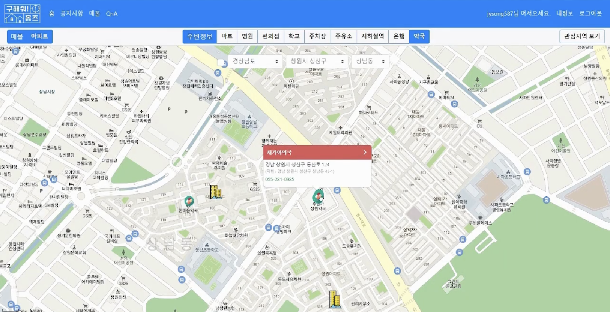

# 🌠 SSAFY 1학기 FinalProject - 구해줘 홈즈!

### 📌 서비스 개요
지도 기반 부동산 매물 정보 조회 사이트

### 📌 개발 기간
2022.11.16 ~ 2022.11.23 (8일)

### 📌 개발 인원
FE : 1명  
BE : 1명

### 📌 기술스택
- FE: Vue2, BootStrapVue2
- BE: SpringBoot, MySQL, MyBatis

### 📌 시연영상
https://www.youtube.com/watch?v=_ERO1F2lcho

# 🌠 담당 역할
1. kakaomap api middleware 개발(kakao.js, kakao-service.js)
- 미들웨어를 통해 추후 팀원이 맵 개발에 들어가더라도 쉽게 들어갈 수 있음(업무 효율성 향상)
- 파일 위치: https://github.com/JuBoks/SSAFY_1th_FinalProject/tree/master/Vue/src/util

2. 공공데이터 포털 오픈 API 분석 및 문서화
- https://docs.google.com/spreadsheets/d/1nuOXs3-x3nTWi-ZH6BfR7KyZWItyyI3vUL8GywYxcb8/edit?usp=sharing

3. 아파트, 연립다세대 DB명세서 정리 및 sql 작성
- https://docs.google.com/spreadsheets/d/1OGLzLOjwNU6aKRS445Vac1VyPdrGQwlOJAPp4nw9YtI/edit?usp=sharing

# 🌠 깨달은 점
- 데이터를 가져와서 가공하고 DB에 넣는 작업이 많이 힘들었다. 처음에 레코드를 넣을 때 ID를 시도코드+구군코드+동코드+개수 같이 의미있는 아이디로 사용해보고 싶어서 프로시저를 만들고 했지만 시간이 너무 오래 걸려서 하지 못했다. 다음에 시도할 때는 쿼리 플랜을 중점으로 개선해보고자 한다. (관련코드: https://github.com/JuBoks/SSAFY_1th_FinalProject/tree/master/sql/%EC%8B%A4%ED%8C%A8)
